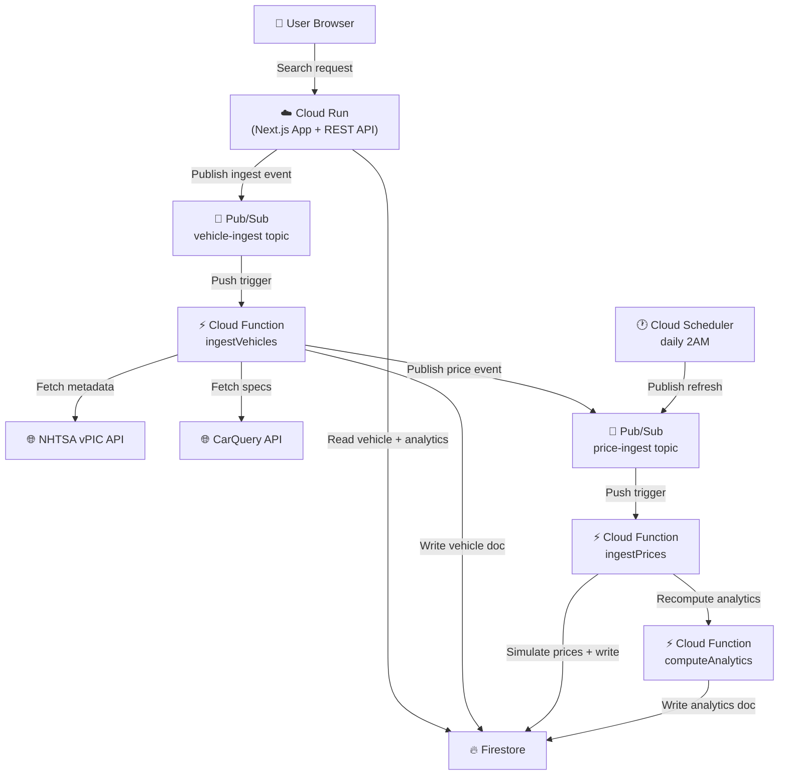

# Vehicle Market Tracker

## Overview
Vehicle Market Tracker is a cloud-based market intelligence app for CSCI391 that lets users search by make, model, and year, then view market pricing trends, volatility, and a buy-vs-wait score. The frontend and API run on Next.js 14, persisted state lives in Firestore, and asynchronous ingestion plus recomputation flows through Cloud Functions and Pub/Sub.

## Architecture Diagram



## Local Development Setup
1. Install dependencies:

```bash
npm install
```

2. Copy the example environment file and fill in your values:

```bash
cp .env.local.example .env.local
```

3. Download a Firebase service account JSON from Firebase Console and place it at `./service-account.json`.
4. Start the local Next.js server:

```bash
npm run dev
```

## Cloud Deployment
1. Authenticate and set project:

```bash
gcloud auth login
gcloud config set project vehicle-market-tracker
```

2. Deploy Cloud Run app:

```bash
bash infra/deploy-cloudrun.sh
```

3. Deploy Cloud Functions:

```bash
bash infra/deploy-functions.sh
```

4. Create Pub/Sub topics + subscriptions:

```bash
bash infra/setup-pubsub.sh
```

5. Configure daily scheduler:

```bash
bash infra/setup-scheduler.sh
```

## GitHub Actions Deployment (Recommended)
The repository includes an automated Cloud Run deploy workflow at `.github/workflows/deploy-cloud-run.yml`.

1. In GitHub, open **Settings > Secrets and variables > Actions**.
2. Add these repository secrets:
	- `GCP_SA_KEY` (full JSON for a service account key)
	- `NEXT_PUBLIC_FB_API_KEY`
	- `NEXT_PUBLIC_FB_AUTH_DOMAIN`
	- `NEXT_PUBLIC_FB_PROJECT_ID`
	- `NEXT_PUBLIC_FB_STORAGE_BUCKET`
	- `NEXT_PUBLIC_FB_MESSAGING_SENDER_ID`
	- `NEXT_PUBLIC_FB_APP_ID`
3. The workflow automatically maps those `NEXT_PUBLIC_FB_*` secrets into both `NEXT_PUBLIC_FB_*` and `FB_WEB_*` env vars during deploy, so you do not need two separate secret sets.
4. Ensure the service account has:
	- `roles/run.admin`
	- `roles/iam.serviceAccountUser`
	- `roles/cloudbuild.builds.editor`
	- `roles/artifactregistry.writer`
5. Push to `main` (or run the workflow manually with **Run workflow**) to deploy.

This keeps deployment repeatable and avoids pasting long deploy commands each time.

## External APIs
- NHTSA vPIC:
	- Base URL: `https://vpic.nhtsa.dot.gov/api/`
	- Endpoint used: `GET /vehicles/GetModelsForMakeYear/make/{make}/modelyear/{year}?format=json`
	- Purpose: make/model/year validation and metadata
- CarQuery:
	- Base URL: `https://www.carqueryapi.com/api/0.3/`
	- Endpoint used: `GET ?cmd=getTrims&make={make}&model={model}&year={year}`
	- Purpose: trims/spec fields (`model_trim`, `model_drive`, `model_fuel_type`, `model_engine_cyl`, `model_body`)
	- Note: response is JSONP and must be unwrapped before parsing

## Data Model
- `vehicles` collection:
	- One document per `{make}_{model}_{year}` vehicle with metadata/spec fields.
- `price_snapshots` collection:
	- Time-series snapshots storing sample size and min/avg/max prices per capture.
- `analytics` collection:
	- One document per vehicle containing 30/90-day averages, volatility, trend direction, and buy score.

## Known Limitations
- Price data is currently simulated using a deterministic market model with bounded random noise instead of paid real listing feeds.
