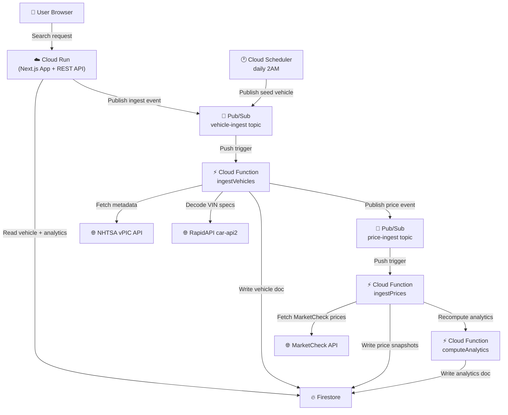

# vehicle market tracker

## overview
this is my csci391 cloud computing final project. you search a used car by make, model, and year and it shows you price trends, volatility, and a buy-vs-wait score based on real market listings. the frontend and api are on next.js 14 running on cloud run, all the data lives in firestore, and background ingestion + analytics recomputation runs through cloud functions triggered by pub/sub.

## architecture diagram



## CSCI391 Constraint Mapping
## csci391 constraint mapping
- rule of three (minimum):
	- compute: cloud run (next.js app + rest api)
	- data/state: firestore (vehicles, snapshots, analytics, users)
	- event/background: pub/sub + cloud functions + cloud scheduler
- no monolith: ui/api on cloud run, ingestion/analytics in separate cloud functions triggered async via pub/sub
- state persistence: everything lives in firestore so container restarts don't lose anything

## deliverable 1 check-in
- architecture pitch + budget: `docs/check-in-pitch-budget.md`
- system diagram: `docs/architecture.md`

## how data flows
1. user searches make/model/year on the cloud run next.js app
2. `GET /api/search` checks firestore for a cached vehicle doc
3. if it's not there yet, cloud run publishes to pub/sub `vehicle-ingest` and returns `202 ingesting`
4. `ingestVehicles` cloud function picks it up, hits nhtsa + marketcheck + rapidapi, and writes normalized vehicle metadata to firestore
5. it then publishes to `price-ingest`
6. `ingestPrices` calls marketcheck for active listings, computes avg/min/max, and writes snapshots to firestore
7. `computeAnalytics` recomputes volatility, trend direction, and buy score
8. the vehicle detail endpoint reads those firestore docs and returns chart-ready json

## local dev setup
1. install deps:

```bash
npm install
```

2. Copy the example environment file and fill in your values:

```bash
cp .env.local.example .env.local
```

3. Configure server-side Firestore credentials by one of these methods:
	- Preferred: download a Firebase service account JSON from Firebase Console and place it at `./service-account.json`.
	- Alternative (local dev): run `./.tools/google-cloud-sdk/bin/gcloud.cmd auth application-default login`.
4. Start the local Next.js server:

```bash
npm run dev
```

## Cloud Deployment
1. Authenticate and set project:

```bash
gcloud auth login
gcloud config set project vehicle-market-tracker
```

2. Deploy Cloud Run app:

```bash
bash infra/deploy-cloudrun.sh
```

3. Deploy Cloud Functions:

```bash
bash infra/deploy-functions.sh
```

4. Create Pub/Sub topics + subscriptions:

```bash
bash infra/setup-pubsub.sh
```

5. Configure daily scheduler:

```bash
bash infra/setup-scheduler.sh
```

## Cloud Run Docker Build (Optional)
If you need explicit container artifacts for submission or manual deploys, this repo includes a root `Dockerfile` and `.dockerignore`.

```bash
gcloud builds submit --tag gcr.io/vehicle-market-tracker/vehicle-market-tracker
gcloud run deploy vehicle-market-tracker \
	--image gcr.io/vehicle-market-tracker/vehicle-market-tracker \
	--region us-central1 \
	--allow-unauthenticated
```

## GitHub Actions Deployment (Recommended)
The repository includes an automated Cloud Run deploy workflow at `.github/workflows/deploy-cloud-run.yml`.

1. In GitHub, open **Settings > Secrets and variables > Actions**.
2. Add these repository secrets:
	```bash
	npm install
	```

	2. copy `.env.local.example` to `.env.local` and fill in your firebase/api keys

	3. for firestore credentials (server-side), either:
		- put a service account json from firebase console at `./service-account.json`
		- or run `./.tools/google-cloud-sdk/bin/gcloud.cmd auth application-default login` for adc

	4. start dev server:

	```bash
	npm run dev
	```

	## deploying to gcp

	i use github actions for deploys — push to `main` and it auto-deploys to cloud run. the workflow is at `.github/workflows/deploy-cloud-run.yml`.

	for first-time setup, add these github secrets under **settings > secrets > actions**:
	- `GCP_SA_KEY`
	- `NEXT_PUBLIC_FB_API_KEY`
	- `NEXT_PUBLIC_FB_AUTH_DOMAIN`
	- `NEXT_PUBLIC_FB_PROJECT_ID`
	- `NEXT_PUBLIC_FB_STORAGE_BUCKET`
	- `NEXT_PUBLIC_FB_MESSAGING_SENDER_ID`
	- `NEXT_PUBLIC_FB_APP_ID`

	the service account needs `roles/run.admin`, `roles/iam.serviceAccountUser`, `roles/cloudbuild.builds.editor`, and `roles/artifactregistry.writer`.

	for one-off manual deploys:

	```bash
	bash infra/deploy-cloudrun.sh
	bash infra/deploy-functions.sh
	bash infra/setup-pubsub.sh
	bash infra/setup-scheduler.sh
	```

	## external apis
	- **nhtsa vpic** — `https://vpic.nhtsa.dot.gov/api/` — used for make/model/year validation and metadata
	- **marketcheck** — `https://api.marketcheck.com/v2/` — real listing prices and vins for snapshot ingestion, api key as query param
	- **rapidapi car-api2** — `https://car-api2.p.rapidapi.com/` — vin decoding for body type, drivetrain, fuel type, trim

	## data model
	- `vehicles` — one doc per `{make}_{model}_{year}` with metadata
	- `price_snapshots` — time-series snapshots with avg/min/max per capture
	- `analytics` — one doc per vehicle with 30/90-day averages, volatility, direction, buy score
	- `users/{uid}/searches` — subcollection tracking which vehicles each user has searched

	## estimated monthly cost
	cloud run $0–$8, firestore $1–$5, cloud functions $0–$3, pub/sub $0–$2, cloud scheduler $0–$1. probably $5–$20/month at student scale.

	## deliverable 2 demo checklist
	- search a vehicle that isn't cached yet and show the ingesting state
	- refresh and show the finished analytics + price chart
	- gcp console tour: cloud run revision, firestore collections, pub/sub topics, cloud functions

	## deliverable 3 screenshot checklist
	- search page
	- vehicle detail page with chart + buy score
	- cloud run service page
	- firestore docs in all three core collections
	- cloud functions overview
	- pub/sub topics page
	- cloud scheduler job

	## teardown
	to spin everything down (e.g. after grading):

	```bash
	bash cleanup.sh
	```

	to also delete the entire gcp project:

	```bash
	DELETE_PROJECT=1 bash cleanup.sh
	```
- Provisioning approach: Mixed CLI + scripts (`infra/*.sh`) + GitHub Actions deploy workflow.
