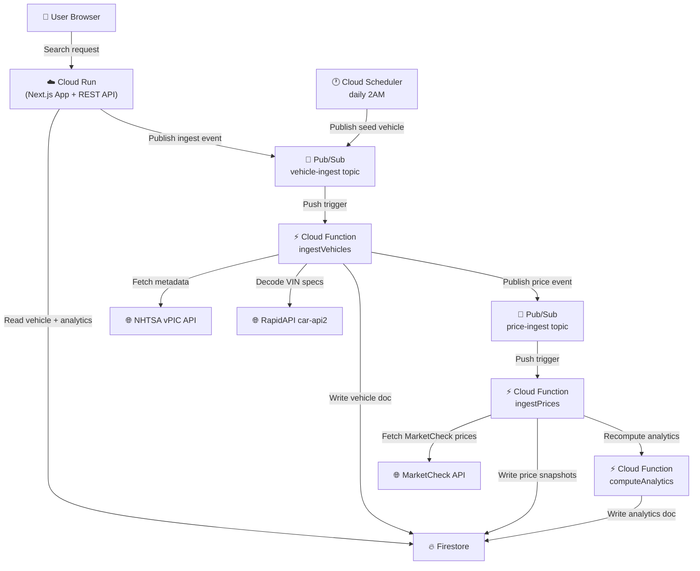

# Vehicle Market Tracker

## Overview
Vehicle Market Tracker is a cloud-based market intelligence app for CSCI391 that lets users search by make, model, and year, then view market pricing trends, volatility, and a buy-vs-wait score. The frontend and API run on Next.js 14, persisted state lives in Firestore, and asynchronous ingestion plus recomputation flows through Cloud Functions and Pub/Sub.

## Architecture Diagram



## CSCI391 Constraint Mapping
- Rule of Three (minimum):
	- Compute layer: Cloud Run (Next.js web app + REST APIs)
	- Data/state layer: Firestore (vehicles, snapshots, analytics)
	- Event/background layer: Pub/Sub + Cloud Functions + Cloud Scheduler
- No Monolith Clause:
	- User-facing API and UI run on Cloud Run.
	- Background ingestion and analytics run in separate Cloud Functions triggered by Pub/Sub.
	- Data is exchanged asynchronously via Pub/Sub topics.
- State Persistence:
	- All persistent state is stored in Firestore collections (`vehicles`, `price_snapshots`, `analytics`).
	- Container/function restarts do not affect persisted data.

## Deliverable 1 Check-In
- Architecture pitch and budget document: `docs/check-in-pitch-budget.md`
- Visual system diagram: `docs/architecture.md`

## Data Flow (Technical Write-Up)
1. User submits make/model/year from the Cloud Run-hosted Next.js UI.
2. `GET /api/search` checks Firestore for a cached vehicle document.
3. If absent, Cloud Run publishes a message to Pub/Sub topic `vehicle-ingest` and returns `202 ingesting`.
4. `ingestVehicles` Cloud Function consumes `vehicle-ingest`, calls NHTSA + MarketCheck + RapidAPI VIN decoding, and writes normalized vehicle metadata to Firestore.
5. `ingestVehicles` publishes a follow-up message to `price-ingest`.
6. `ingestPrices` Cloud Function consumes `price-ingest`, calls MarketCheck inventory search, computes snapshot avg/min/max, and writes to `price_snapshots`.
7. `computeAnalytics` recomputes volatility, trend direction, and buy score and writes to `analytics`.
8. Vehicle detail endpoint reads Firestore snapshots + analytics and returns chart-ready response.

## Local Development Setup
1. Install dependencies:

```bash
npm install
```

2. Copy the example environment file and fill in your values:

```bash
cp .env.local.example .env.local
```

3. Configure server-side Firestore credentials by one of these methods:
	- Preferred: download a Firebase service account JSON from Firebase Console and place it at `./service-account.json`.
	- Alternative (local dev): run `./.tools/google-cloud-sdk/bin/gcloud.cmd auth application-default login`.
4. Start the local Next.js server:

```bash
npm run dev
```

## Cloud Deployment
1. Authenticate and set project:

```bash
gcloud auth login
gcloud config set project vehicle-market-tracker
```

2. Deploy Cloud Run app:

```bash
bash infra/deploy-cloudrun.sh
```

3. Deploy Cloud Functions:

```bash
bash infra/deploy-functions.sh
```

4. Create Pub/Sub topics + subscriptions:

```bash
bash infra/setup-pubsub.sh
```

5. Configure daily scheduler:

```bash
bash infra/setup-scheduler.sh
```

## Cloud Run Docker Build (Optional)
If you need explicit container artifacts for submission or manual deploys, this repo includes a root `Dockerfile` and `.dockerignore`.

```bash
gcloud builds submit --tag gcr.io/vehicle-market-tracker/vehicle-market-tracker
gcloud run deploy vehicle-market-tracker \
	--image gcr.io/vehicle-market-tracker/vehicle-market-tracker \
	--region us-central1 \
	--allow-unauthenticated
```

## GitHub Actions Deployment (Recommended)
The repository includes an automated Cloud Run deploy workflow at `.github/workflows/deploy-cloud-run.yml`.

1. In GitHub, open **Settings > Secrets and variables > Actions**.
2. Add these repository secrets:
	- `GCP_SA_KEY` (full JSON for a service account key)
	- `NEXT_PUBLIC_FB_API_KEY`
	- `NEXT_PUBLIC_FB_AUTH_DOMAIN`
	- `NEXT_PUBLIC_FB_PROJECT_ID`
	- `NEXT_PUBLIC_FB_STORAGE_BUCKET`
	- `NEXT_PUBLIC_FB_MESSAGING_SENDER_ID`
	- `NEXT_PUBLIC_FB_APP_ID`
3. The workflow automatically maps those `NEXT_PUBLIC_FB_*` secrets into both `NEXT_PUBLIC_FB_*` and `FB_WEB_*` env vars during deploy, so you do not need two separate secret sets.
4. Ensure the service account has:
	- `roles/run.admin`
	- `roles/iam.serviceAccountUser`
	- `roles/cloudbuild.builds.editor`
	- `roles/artifactregistry.writer`
5. Push to `main` (or run the workflow manually with **Run workflow**) to deploy.

This keeps deployment repeatable and avoids pasting long deploy commands each time.

## External APIs
- NHTSA vPIC:
	- Base URL: `https://vpic.nhtsa.dot.gov/api/`
	- Endpoint used: `GET /vehicles/GetModelsForMakeYear/make/{make}/modelyear/{year}?format=json`
	- Purpose: make/model/year validation and metadata
- MarketCheck:
	- Base URL: `https://api.marketcheck.com/v2/`
	- Endpoint used: `GET /search/car/active?make={make}&model={model}&year={year}&car_type=used&stats=price`
	- Purpose: real market listing prices, VINs, and listing metadata for snapshot ingestion plus fallback spec enrichment
	- Auth: API key passed as `api_key` query parameter
- RapidAPI car-api2:
	- Base URL: `https://car-api2.p.rapidapi.com/`
	- Endpoint used: `GET /api/vin/{vin}`
	- Purpose: VIN-decoded body, drivetrain, fuel type, cylinder count, and trim enrichment
	- Auth: `x-rapidapi-host` and `x-rapidapi-key` headers

## Data Model
- `vehicles` collection:
	- One document per `{make}_{model}_{year}` vehicle with metadata/spec fields.
- `price_snapshots` collection:
	- Time-series snapshots storing sample size and min/avg/max prices per capture.
- `analytics` collection:
	- One document per vehicle containing 30/90-day averages, volatility, trend direction, and buy score.

## Estimated Monthly Cost (Student-Scale)
- Cloud Run: $0 - $8
- Firestore: $1 - $5
- Cloud Functions: $0 - $3
- Pub/Sub: $0 - $2
- Cloud Scheduler: $0 - $1
- Total estimate: $5 - $20 / month

## Deliverable 2: Live Demo Checklist
- Pitch:
	- Explain purpose: vehicle market intelligence for buy-vs-wait decisions.
- Live app demo:
	- Search a vehicle not yet cached and show ingestion state.
	- Refresh and show completed analytics + chart.
- GCP Console tour:
	- Cloud Run service status and revision.
	- Firestore collections populated (`vehicles`, `price_snapshots`, `analytics`).
	- Pub/Sub topics (`vehicle-ingest`, `price-ingest`).
	- Cloud Functions (`ingestVehicles`, `ingestPrices`, `computeAnalytics`).

## Deliverable 3: Write-Up Screenshot Checklist
Add the following screenshots to your repo before submission:
- Running web app search page.
- Vehicle detail page with chart + buy score.
- Cloud Run service details page.
- Firestore documents in all three core collections.
- Cloud Functions overview page.
- Pub/Sub topics page.
- Cloud Scheduler job page.

## Post-Mortem Notes (Example)
- Issue: Pricing pipeline initially used simulated values, violating real-data requirement.
- Fix: Integrated MarketCheck API in both ingestion paths and validated live responses.
- Issue: Frontend build was blocked by side-effect CSS import typing issue in client components.
- Fix: Removed side-effect CSS imports and inlined equivalent utility class styling.
- Provisioning approach: Mixed CLI + scripts (`infra/*.sh`) + GitHub Actions deploy workflow.

## Teardown Proof
This repo includes a full teardown script required by the assignment:

```bash
bash cleanup.sh
```

The script deletes Cloud Scheduler jobs, 2nd gen Cloud Functions, Cloud Run service, and Pub/Sub topics/subscriptions for this project.

For a guaranteed no-billing teardown, it can also delete the entire Google Cloud project:

```bash
DELETE_PROJECT=1 bash cleanup.sh
```

## Known Limitations
- MarketCheck free tier quota is limited (e.g., 500 calls/month), so scheduler defaults should stay conservative for class-project scale.
