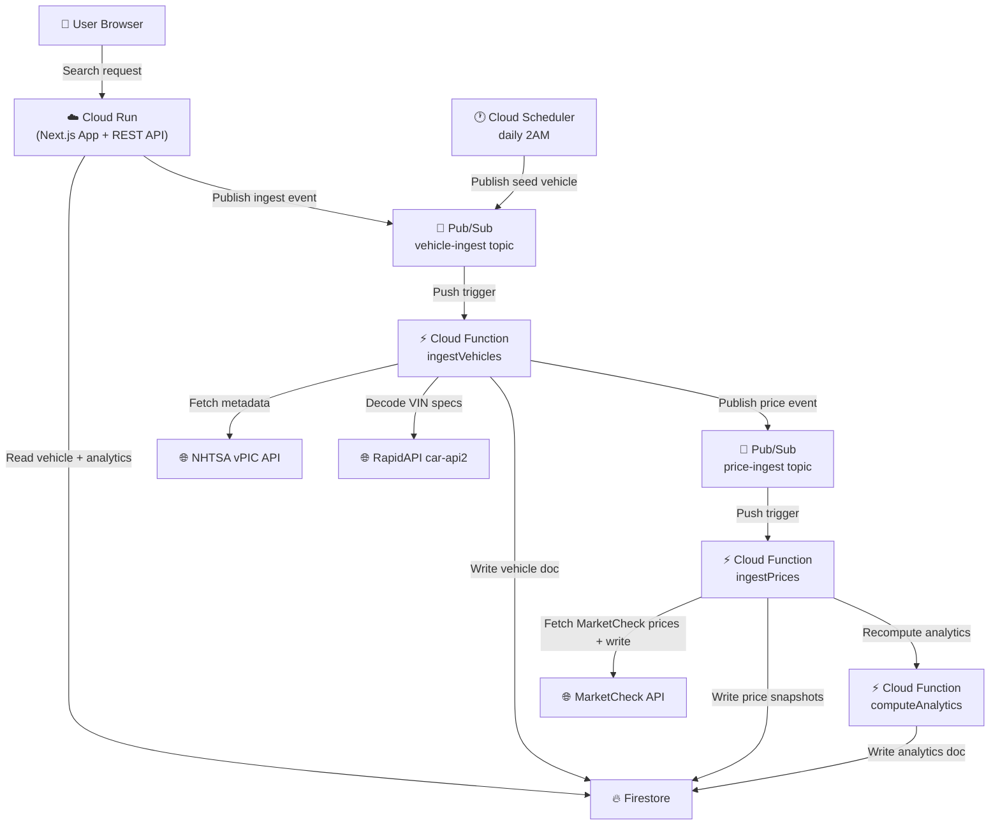

# Vehicle Market Tracker Architecture

```mermaid
flowchart TD
    User["👤 User Browser"] -->|Search request| CR["☁️ Cloud Run\n(Next.js App + REST API)"]
    CR -->|Read vehicle + analytics| FS["🔥 Firestore"]
    CR -->|Publish ingest event| PS1["📨 Pub/Sub\nvehicle-ingest topic"]
    PS1 -->|Push trigger| CF1["⚡ Cloud Function\ningestVehicles"]
    CF1 -->|Fetch metadata| NHTSA["🌐 NHTSA vPIC API"]
    CF1 -->|Decode VIN specs| RAPID["🌐 RapidAPI car-api2"]
    CF1 -->|Write vehicle doc| FS
    CF1 -->|Publish price event| PS2["📨 Pub/Sub\nprice-ingest topic"]
    PS2 -->|Push trigger| CF2["⚡ Cloud Function\ningestPrices"]
    CF2 -->|Fetch MarketCheck prices + write| MC["🌐 MarketCheck API"]
    CF2 -->|Write price snapshots| FS
    CF2 -->|Recompute analytics| CF3["⚡ Cloud Function\ncomputeAnalytics"]
    CF3 -->|Write analytics doc| FS
    SCHED["🕐 Cloud Scheduler\ndaily 2AM"] -->|Publish seed vehicle| PS1
```
